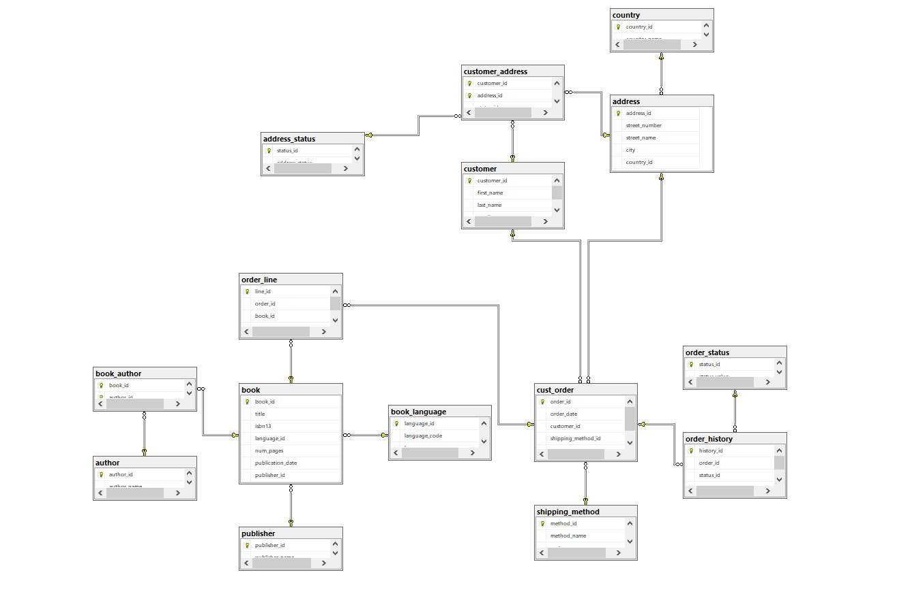
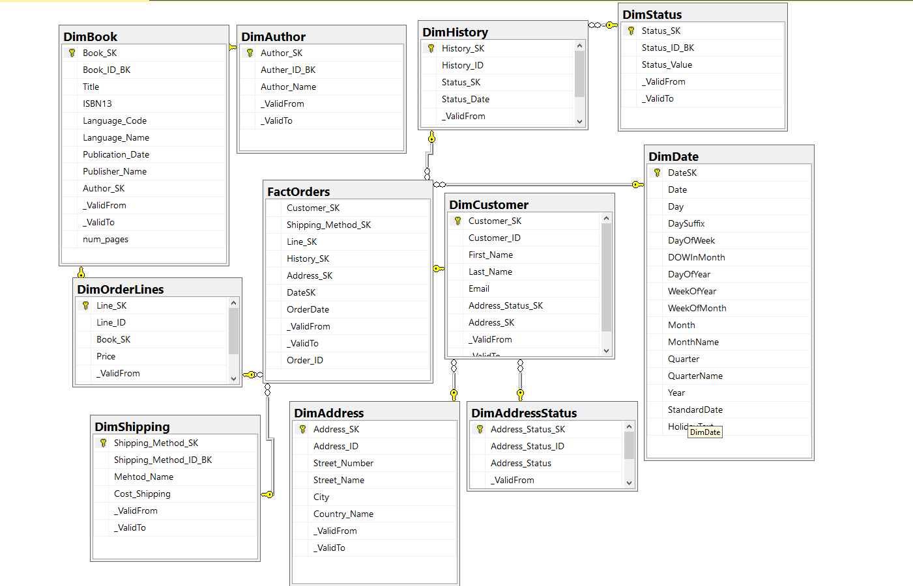
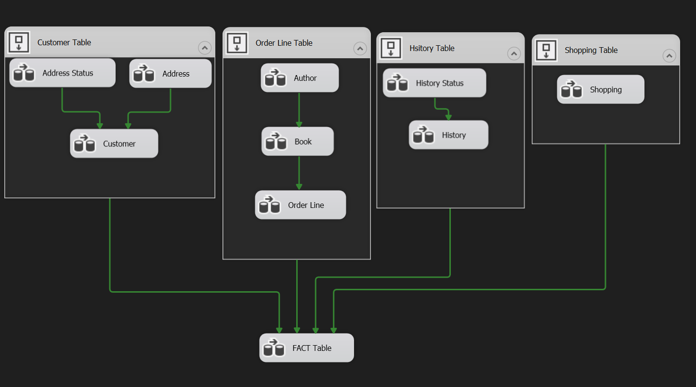
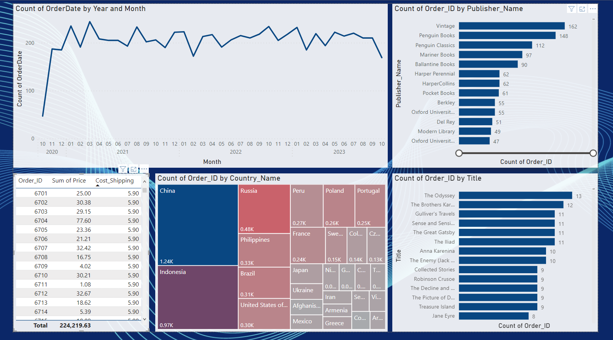

# Gravity Books Data Warehouse and BI Project

## Description
This repository contains the source code and documentation for the Gravity Books Data Warehouse and Business Intelligence (BI) project. The project involves modeling, building a data warehouse, and creating BI reports for Gravity Bookstore, a fictional bookstore.

## Requirements
- SQL Server
- SQL Server Integration Services (SSIS)
- SQL Server Analysis Services (SSAS)
- Power BI or PowerPivot in Excel

## Getting Started
1. **Clone the repository:**
    ```bash
    git clone https://github.com/Mohamed-Ahmed-Ali/gravity-books-dwh-bi.git
    cd gravity-books-dwh-bi
    ```
2. **Follow the steps in the [Requirements](#requirements) section to set up the necessary tools and databases.**
3. **Execute the SQL scripts in the `dwh_ddl` folder to create the data warehouse tables.**
4. **Open and run the SSIS project in the `etl_ssis` folder to populate the data from the transactional database to the data warehouse.**
5. **Open and deploy the SSAS project in the `olap_ssas` folder to create the OLAP cube.**
6. **Open the Power BI or PowerPivot project in the `bi_reports` folder to explore the data and create analytical reports.**

## Folder Structure
- `dwh_ddl`: Contains DDL SQL scripts for creating the data warehouse tables.
- `etl_ssis`: Contains the SSIS project for ETL processes.
- `olap_ssas`: Contains the SSAS project for creating the OLAP cube.
- `bi_reports`: Contains the Power BI or PowerPivot project for creating BI reports.
- `screenshots`: Contains screenshots of the output at various stages.

## Task Requirements
### 1. Model and develop ‘gravity_books_dwh’ Data Warehouse
   - Execute the DDL statements in the following order:
      1. `01_CreateDimDate.sql`: Creates the date dimension table.
      2. `02_BookStore_DDL.sql`: Creates data warehouse tables.
   - [Screenshot](./screenshots/dwh_erd.png): Visual representation of the Data Warehouse ERD.

### 2. Define which approach (star schema, snowflake) of data warehouse used in your solution, and why.
   - **Approach Used:** Snowflake Schema
   - **Explanation:** Chosen for its normalized structure, reducing redundancy and improving data integrity.

### 3. Define a method to check and maintain the integrity between the fact and the dimensions (SQL).
   - Integrity checks are implemented using foreign key constraints in the DDL scripts.

### 4. Add a date dimension to the system to track historical changes.
   - A date dimension (`dim_date`) is added to track historical changes in the system, supporting time-based analysis.

### 5. Design an SSIS project to populate the data from ‘gravity_books’ transactional database into the new target data warehouse ‘gravity_books_dwh’.
   - The SSIS project in `etl_ssis` extracts and transforms data from the transactional database to the data warehouse.

### 6. Design an SSAS project (Tabular mode) and provide the main deliverables of the cube browsing.
   - The SSAS project in `olap_ssas` creates a tabular cube. Key deliverables include hierarchies for books, authors, and time dimensions.

### 7. Using either PowerPivot in Excel or Power BI Desktop, create BI self-service reporting for exploring gravity books OLAP cube.
   - The Power BI project in `bi_reports` explores the OLAP cube, providing a self-service canvas for business insights.
   - Sample analytical reports and a dashboard are created.

## Screenshots

 







## Contributing
If you'd like to contribute to the project, please follow the standard GitHub flow:
1. Fork the repository.
2. Create a new branch for your feature or bug fix.
3. Make your changes and submit a pull request.

